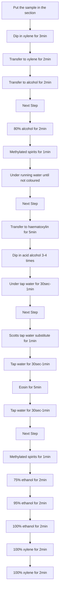

```mermaid
graph TD;
    A[Put the sample in the section] --> B[Dip in xylene for 3min];
    B --> C[Transfer to xylene for 2min];
    C --> D[Transfer to alcohol for 2min];
    D --> Z1[Next Step];

    Z1 --> E[80% alcohol for 2min];
    E --> F[Methylated spirits for 1min];
    F --> G[Under running water until not coloured];
    G --> Z2[Next Step];

    Z2 --> H[Transfer to haematoxylin for 5min];
    H --> I[Dip in acid alcohol 3-4 times];
    I --> J[Under tap water for 30sec-1min];
    J --> Z3[Next Step];

    Z3 --> K[Scotts tap water substitute for 1min];
    K --> L[Tap water for 30sec-1min];
    L --> M[Eosin for 5min];
    M --> N[Tap water for 30sec-1min];
    N --> Z4[Next Step];

    Z4 --> O[Methylated spirits for 1min];
    O --> P[75% ethanol for 2min];
    P --> Q[95% ethanol for 2min];
    Q --> R[100% ethanol for 2min];
    R --> S[100% xylene for 2min];
    S --> T[100% xylene for 2min];
```
